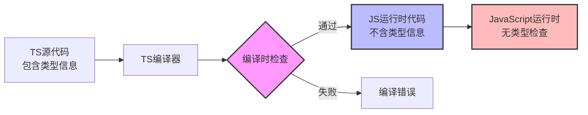

# TypeScript库的JavaScript运行时类型检查指南

## 引言

在当前的Web开发环境中，TypeScript已经成为了许多开发者的首选语言。它的静态类型系统为大型项目提供了可靠的类型安全保障，显著提升了代码的可维护性和开发效率。然而，当一个TypeScript库被编译为JavaScript并在纯JavaScript环境中使用时，一个关键问题就会浮现：原本在TypeScript中有效的类型检查，在JavaScript环境下完全失效了。

这个问题不仅影响库的稳定性，还可能给使用者带来难以调试的错误。本文将从问题分析、原因探讨、解决方案到实现方法，全面阐述如何在TypeScript库中实现跨环境的类型安全。

## 1. 问题：类型安全的边界

在TypeScript开发中，我们经常遇到这样一个典型场景：精心编写的TypeScript库在编译为JavaScript后，当被纯JavaScript代码调用时，原本在编译阶段有效的类型检查就完全失效了。

考虑一个简单的TypeScript函数：

```typescript
// 编译前TypeScript代码
function getText(num: number): string {
  return `Number: ${num}`;
}
```

这段代码经过TypeScript编译器处理后，会生成如下JavaScript代码：

```javascript
// 编译后的JavaScript代码
function getText(num) {
  return `Number: ${num}`;
}
```

这里的关键变化是：所有的类型信息都消失了。在TypeScript环境中，如果我们错误地调用`getText("hello")`，编译器会立即报错：

```
Argument of type 'string' is not assignable to parameter of type 'number'.
```

但在JavaScript环境中，这个错误调用会顺利通过，然后在运行时产生非预期的结果：

```javascript
// JavaScript代码中
getText("hello");        // 返回 "Number: hello"，逻辑错误
getText(null);           // 返回 "Number: null"，可能引发后续错误
getText(undefined);      // 返回 "Number: undefined"
```

更糟糕的是，如果函数内部执行了数值运算，还会产生运行时异常：

```typescript
function calculatePrice(quantity: number, price: number): number {
  return quantity * price;
}

// JavaScript中
calculatePrice("3", 100);  // 返回 300（JavaScript的类型转换）
calculatePrice(null, 100); // 返回 0
calculatePrice(undefined, 100); // 返回 NaN
```

## 2. 原因：编译时的类型检查

### 2.1 TypeScript的设计原则

要理解这个问题的根源，需要了解TypeScript的基本设计原则。TypeScript本质上是一个添加了静态类型系统的JavaScript超集，它的核心目标包括：

1. **不改变JavaScript的运行时行为**
2. **不增加不必要的运行时开销**
3. **提供渐进式类型系统**

这些原则决定了TypeScript的类型检查主要在编译时进行。在编译过程中，TypeScript编译器会：

1. 分析类型信息，进行类型检查
2. 生成纯JavaScript代码
3. 丢弃所有类型信息（除非明确配置生成类型声明文件）

### 2.2 类型信息的生命周期

TypeScript的类型系统遵循以下生命周期：



从上图可以看出，类型检查只发生在编译时（图中粉色部分），运行时的JavaScript代码（蓝色部分）完全不包含类型信息，因此无法在JavaScript环境中进行类型检查。

### 2.3 实际应用场景

在实际项目中，TypeScript库被JavaScript调用的场景非常普遍：

1. **渐进式迁移**：传统网站在向TypeScript迁移过程中，新旧代码并存
2. **多技术栈**：不同团队使用不同技术栈，JavaScript团队需要调用TypeScript团队开发的库
3. **第三方集成**：你的TypeScript库被其他公司或团队使用，而他们仍在使用JavaScript
4. **构建工具限制**：某些构建流程或工具链尚未完全支持TypeScript

根据2023年GitHub的调研数据，在同时包含TypeScript和JavaScript文件的仓库中：

- 68%的仓库存在TypeScript和JavaScript文件的互相调用
- 42%的开发者表示遇到过因跨语言调用导致的类型安全问题
- 只有23%的TypeScript库为JavaScript使用者提供了完整的运行时类型检查

## 3. 解决思路

### 3.1 核心思路：运行时类型检查

解决这个问题的核心思路是：在TypeScript函数的入口处添加运行时类型检查。这确保了无论调用方是TypeScript还是JavaScript代码，都能在第一时间发现类型错误。

基本的实现模式如下：

```typescript
function getText(num: number): string {
  // 运行时类型检查
  if (typeof num !== 'number' || isNaN(num)) {
    throw new TypeError(`Expected a number, but got: ${typeof num}`);
  }
  
  // 主逻辑
  return `Number: ${num}`;
}
```

### 3.2 解决方案分类

根据项目的复杂度和需求，可以选择不同的解决方案：

#### 3.2.1 手动类型检查

最简单的方案是在每个公共函数入口手动添加类型检查：

```typescript
function validateNumber(value: unknown, paramName: string): asserts value is number {
  if (typeof value !== 'number') {
    throw new TypeError(`${paramName} must be a number, got ${typeof value}`);
  }
  if (isNaN(value)) {
    throw new TypeError(`${paramName} must be a valid number, got NaN`);
  }
}

function getText(num: number): string {
  validateNumber(num, 'num');
  return `Number: ${num}`;
}
```

**优点**：
- 零依赖
- 高性能
- 完全可控

**缺点**：
- 代码重复
- 维护成本高
- 容易遗漏检查

#### 3.2.2 使用运行时类型校验库

社区提供了多个专门的运行时类型检查库，它们可以更优雅地解决这个问题：

1. **Zod**：TypeScript优先的schema声明和验证库
2. **io-ts**：函数式风格的运行时类型系统
3. **yup**：对象schema验证器
4. **DeepKit**：保留TypeScript类型信息到运行时

这些库的核心思想是：定义一个运行时可用的schema，然后用它来验证数据。

#### 3.2.3 装饰器方案

如果使用类和方法装饰器，可以在装饰器中统一处理类型检查：

```typescript
import 'reflect-metadata';

function ValidateTypes() {
  return function (target: any, propertyKey: string, descriptor: PropertyDescriptor) {
    const originalMethod = descriptor.value;
    const paramTypes = Reflect.getMetadata('design:paramtypes', target, propertyKey);
    
    descriptor.value = function (...args: any[]) {
      for (let i = 0; i < args.length; i++) {
        const expectedType = paramTypes[i];
        const actualValue = args[i];
        
        if (expectedType === Number && typeof actualValue !== 'number') {
          throw new TypeError(`Parameter ${i} must be a number`);
        }
        // 其他类型检查...
      }
      
      return originalMethod.apply(this, args);
    };
  };
}

class Calculator {
  @ValidateTypes()
  add(a: number, b: number): number {
    return a + b;
  }
}
```

## 4. 实现方法

### 4.1 基础手动检查实现

对于简单的库，手动类型检查是最直接的方法。以下是一个完整的实现示例：

```typescript
// 基础类型检查函数
function assertType<T>(
  value: unknown,
  typeGuard: (value: unknown) => boolean,
  typeName: string,
  paramName: string
): asserts value is T {
  if (!typeGuard(value)) {
    const actualType = value === null ? 'null' : typeof value;
    throw new TypeError(
      `Expected ${paramName} to be ${typeName}, got ${actualType}`
    );
  }
}

// 预定义的检查函数
const TypeGuards = {
  number: (value: unknown): value is number => 
    typeof value === 'number' && !isNaN(value) && isFinite(value),
  
  string: (value: unknown): value is string => 
    typeof value === 'string',
  
  boolean: (value: unknown): value is boolean => 
    typeof value === 'boolean',
  
  array: (value: unknown): value is unknown[] => 
    Array.isArray(value),
  
  object: (value: unknown): value is Record<string, unknown> =>
    value !== null && typeof value === 'object' && !Array.isArray(value),
} as const;

// 使用示例
function getText(num: number): string {
  assertType<number>(num, TypeGuards.number, 'number', 'num');
  return `Number: ${num}`;
}

function joinStrings(strings: string[]): string {
  assertType<string[]>(strings, TypeGuards.array, 'string[]', 'strings');
  strings.forEach((str, i) => {
    assertType<string>(str, TypeGuards.string, 'string', `strings[${i}]`);
  });
  return strings.join(', ');
}
```

### 4.2 使用Zod实现

Zod是一个流行的TypeScript-first的schema验证库，它允许你定义schema，并从中推断TypeScript类型。

```typescript
import { z } from 'zod';

// 定义schema
const GetTextParams = z.object({
  num: z.number()
    .min(0, 'Number must be non-negative')
    .max(100, 'Number must be less than or equal to 100')
});

// 从schema推断TypeScript类型
type GetTextParamsType = z.infer<typeof GetTextParams>;

// 使用schema验证的函数
function getTextSafe(input: unknown): string {
  try {
    // 运行时验证
    const validated = GetTextParams.parse({ num: input });
    return `Number: ${validated.num}`;
  } catch (error) {
    if (error instanceof z.ZodError) {
      // 格式化的错误信息
      const errorMessages = error.errors.map(err => 
        `${err.path.join('.')}: ${err.message}`
      ).join('; ');
      
      throw new TypeError(`Invalid parameters: ${errorMessages}`);
    }
    throw error;
  }
}

// 安全的包装函数
function getText(num: number): string {
  return getTextSafe(num);
}
```

Zod的优势在于：
- 单一数据源：schema同时定义运行时验证和TypeScript类型
- 丰富的验证规则：最小值、最大值、正则表达式等
- 清晰的错误信息
- 良好的TypeScript集成

### 4.3 使用io-ts实现

io-ts是一个函数式风格的运行时类型系统，特别适合与函数式编程范式结合：

```typescript
import * as t from 'io-ts';
import { isLeft } from 'fp-ts/Either';
import { PathReporter } from 'io-ts/PathReporter';

// 定义运行时类型
const User = t.type({
  id: t.number,
  name: t.string,
  email: t.string,
  age: t.union([t.number, t.undefined]),
  tags: t.array(t.string)
});

// 推断静态类型
type User = t.TypeOf<typeof User>;

// 验证函数
function validateUser(input: unknown): User {
  const result = User.decode(input);
  
  if (isLeft(result)) {
    const errors = PathReporter.report(result);
    throw new TypeError(`Invalid user data: ${errors.join(', ')}`);
  }
  
  return result.right;
}

// 使用示例
function processUser(userInput: unknown): string {
  const user = validateUser(userInput);
  return `Processing user: ${user.name}`;
}
```

### 4.4 单元测试策略

为确保运行时类型检查的有效性，需要编写专门的单元测试。关键是使用类型断言绕过TypeScript的编译时检查，测试JavaScript运行时的行为：

```typescript
import { getText } from './text-library';

describe('getText runtime type checking', () => {
  // 有效输入的测试用例
  describe('valid inputs', () => {
    it('should accept positive numbers', () => {
      expect(getText(42)).toBe('Number: 42');
    });
    
    it('should accept zero', () => {
      expect(getText(0)).toBe('Number: 0');
    });
    
    it('should accept negative numbers', () => {
      expect(getText(-3.14)).toBe('Number: -3.14');
    });
    
    it('should accept large numbers', () => {
      expect(getText(1e6)).toBe('Number: 1000000');
    });
  });
  
  // 无效输入的测试用例
  describe('invalid inputs', () => {
    it('should reject strings', () => {
      // 使用类型断言绕过TypeScript编译时检查
      expect(() => getText('42' as any)).toThrow(TypeError);
    });
    
    it('should reject null', () => {
      expect(() => getText(null as any)).toThrow(TypeError);
    });
    
    it('should reject undefined', () => {
      expect(() => getText(undefined as any)).toThrow(TypeError);
    });
    
    it('should reject objects', () => {
      expect(() => getText({ value: 42 } as any)).toThrow(TypeError);
    });
    
    it('should reject arrays', () => {
      expect(() => getText([1, 2, 3] as any)).toThrow(TypeError);
    });
    
    it('should reject NaN', () => {
      expect(() => getText(NaN)).toThrow(TypeError);
    });
    
    it('should reject Infinity', () => {
      expect(() => getText(Infinity)).toThrow(TypeError);
    });
  });
  
  // 错误信息测试
  describe('error messages', () => {
    it('should include expected type in error', () => {
      try {
        getText('not a number' as any);
        fail('Expected error was not thrown');
      } catch (error) {
        if (error instanceof TypeError) {
          expect(error.message).toContain('number');
        } else {
          fail('Caught error is not TypeError');
        }
      }
    });
    
    it('should include actual type in error', () => {
      try {
        getText(null as any);
        fail('Expected error was not thrown');
      } catch (error) {
        if (error instanceof TypeError) {
          expect(error.message).toContain('null');
        }
      }
    });
  });
});
```

## 5. 方案比较与选择

### 5.1 方案对比表

| 方案 | 适用场景 | 优点 | 缺点 | 性能影响 | 学习曲线 |
|------|----------|------|------|----------|----------|
| **手动检查** | 简单库、少量API | 零依赖、高性能、完全可控 | 代码重复、维护成本高 | 低 | 低 |
| **Zod** | 复杂数据验证、全栈应用 | 单一数据源、丰富验证、优秀TS集成 | 额外依赖、运行时开销 | 中 | 中 |
| **io-ts** | 函数式代码、复杂类型系统 | 类型安全度高、组合能力强 | 函数式风格、学习成本高 | 中 | 高 |
| **yup** | 表单验证、前端应用 | 易用、链式API、良好文档 | 非TypeScript优先设计 | 低-中 | 低 |
| **装饰器** | 类库、DI框架 | 声明式、关注点分离 | 装饰器语法、反射性能开销 | 中-高 | 中 |
| **DeepKit** | 全栈框架、高性能需求 | 运行时类型、序列化、验证一体化 | 生态较新、需编译插件 | 低 | 中-高 |

### 5.2 选择指南

#### 5.2.1 根据项目规模选择

**小型工具库（< 10个导出函数）**
- 推荐：手动类型检查
- 理由：依赖少，实现简单，性能最佳

**中型库（10-50个导出函数）**
- 推荐：Zod或yup
- 理由：减少重复代码，提供一致的验证逻辑

**大型框架（> 50个导出函数）**
- 推荐：io-ts或DeepKit
- 理由：强大的类型组合能力，适合复杂类型系统

#### 5.2.2 根据团队技术栈选择

**前端团队**
- 推荐：Zod或yup
- 理由：API设计直观，与前端生态集成好

**函数式编程团队**
- 推荐：io-ts
- 理由：函数式设计，与fp-ts生态完美集成

**全栈团队**
- 推荐：DeepKit
- 理由：前后端类型共享，序列化支持

#### 5.2.3 根据性能需求选择

**高性能场景**
- 推荐：手动检查或DeepKit
- 理由：最小化运行时开销

**一般业务场景**
- 推荐：Zod
- 理由：良好平衡性能与功能

**数据转换密集**
- 推荐：io-ts
- 理由：强大的数据转换能力

### 5.3 混合方案

在实际项目中，也可以采用混合方案，根据不同的需求使用不同的验证策略：

```typescript
// 混合使用手动检查和Zod
import { z } from 'zod';

// 简单参数使用手动检查
function simpleFunction(num: number, str: string): string {
  if (typeof num !== 'number' || isNaN(num)) {
    throw new TypeError(`num must be a number`);
  }
  if (typeof str !== 'string') {
    throw new TypeError(`str must be a string`);
  }
  return `${str}: ${num}`;
}

// 复杂参数使用Zod
const ComplexSchema = z.object({
  user: z.object({
    id: z.number(),
    name: z.string(),
    preferences: z.record(z.string(), z.any()).optional()
  }),
  settings: z.array(z.object({
    key: z.string(),
    value: z.union([z.string(), z.number(), z.boolean()])
  }))
});

function complexFunction(input: unknown): void {
  const validated = ComplexSchema.parse(input);
  // 使用已验证的数据
  console.log(`Processing user: ${validated.user.name}`);
}
```

## 6. 最佳实践

### 6.1 错误处理策略

良好的错误信息能显著提升开发体验：

```typescript
function validateWithContext(
  value: unknown,
  validator: (value: unknown) => boolean,
  expectedType: string,
  context: {
    paramName: string;
    functionName: string;
    index?: number;
  }
): void {
  if (!validator(value)) {
    const actualType = getTypeDescription(value);
    const location = context.index !== undefined 
      ? `parameter "${context.paramName}" at index ${context.index}`
      : `parameter "${context.paramName}"`;
    
    throw new TypeError(
      `${context.functionName}: Expected ${location} to be ${expectedType}, ` +
      `but got ${actualType}. Value: ${formatValueForDisplay(value)}`
    );
  }
}

function getTypeDescription(value: unknown): string {
  if (value === null) return 'null';
  if (value === undefined) return 'undefined';
  if (Array.isArray(value)) return 'array';
  if (typeof value === 'object') return 'object';
  return typeof value;
}

function formatValueForDisplay(value: unknown): string {
  if (typeof value === 'string') return `"${value}"`;
  if (typeof value === 'object') return JSON.stringify(value);
  return String(value);
}
```

### 6.2 性能优化

运行时类型检查会带来性能开销，以下优化策略可以减少影响：

1. **开发/生产环境区分**
```typescript
function validateNumber(value: unknown, paramName: string): asserts value is number {
  if (process.env.NODE_ENV !== 'production') {
    if (typeof value !== 'number' || isNaN(value)) {
      throw new TypeError(`${paramName} must be a number`);
    }
  }
}
```

2. **缓存验证结果**
```typescript
const validationCache = new WeakMap<object, boolean>();

function validateComplexObject(obj: object): boolean {
  if (validationCache.has(obj)) {
    return validationCache.get(obj)!;
  }
  
  const isValid = // 复杂验证逻辑
  validationCache.set(obj, isValid);
  return isValid;
}
```

3. **延迟验证**
```typescript
class LazyValidation<T> {
  private value: T;
  private isValidated = false;
  
  constructor(value: T) {
    this.value = value;
  }
  
  getValue(): T {
    if (!this.isValidated) {
      validate(this.value);
      this.isValidated = true;
    }
    return this.value;
  }
}
```

### 6.3 测试策略

全面的测试是确保运行时类型检查可靠的关键：

```typescript
// 使用测试工厂生成测试用例
function createValidationTests(
  validator: (value: unknown) => boolean,
  testCases: Array<{
    value: unknown;
    shouldPass: boolean;
    description: string;
  }>
) {
  return testCases.map(({ value, shouldPass, description }) => ({
    value,
    shouldPass,
    description,
    test: () => {
      if (shouldPass) {
        expect(() => validator(value)).not.toThrow();
      } else {
        expect(() => validator(value)).toThrow();
      }
    }
  }));
}

// 使用示例
const numberTests = createValidationTests(
  (value): value is number => typeof value === 'number' && !isNaN(value),
  [
    { value: 42, shouldPass: true, description: '正常数字' },
    { value: 0, shouldPass: true, description: '零' },
    { value: -1.5, shouldPass: true, description: '负数' },
    { value: '42', shouldPass: false, description: '字符串数字' },
    { value: NaN, shouldPass: false, description: 'NaN' },
    { value: Infinity, shouldPass: false, description: '无穷大' },
    { value: null, shouldPass: false, description: 'null' },
    { value: undefined, shouldPass: false, description: 'undefined' },
  ]
);
```

## 7. 结论

TypeScript库在JavaScript环境中的类型安全问题是一个实际且重要的问题。通过实施运行时类型检查，我们可以在保持TypeScript静态类型优势的同时，为JavaScript使用者提供可靠的错误预防机制。

选择具体的实现方案需要综合考虑项目规模、团队技术栈、性能需求和维护成本。对于大多数项目，Zod提供了良好的平衡点：它既保持了TypeScript-first的设计理念，又提供了丰富的验证功能。

无论选择哪种方案，核心原则是一致的：
1. **在公共API边界添加类型检查**
2. **提供清晰的错误信息**
3. **编写全面的测试**
4. **考虑性能影响**

通过实施这些策略，你可以构建出既对TypeScript用户友好，又对JavaScript用户可靠的库。这种跨环境的可靠性是现代JavaScript生态系统中高质量库的重要标志。

## 扩展阅读

1. https://www.typescriptlang.org/docs/handbook/type-checking-javascript-files.html
2. https://zod.dev/
3. https://github.com/gcanti/io-ts
4. https://deepkit.io/library/type
5. https://www.totaltypescript.com/writing-robust-typescript-libraries